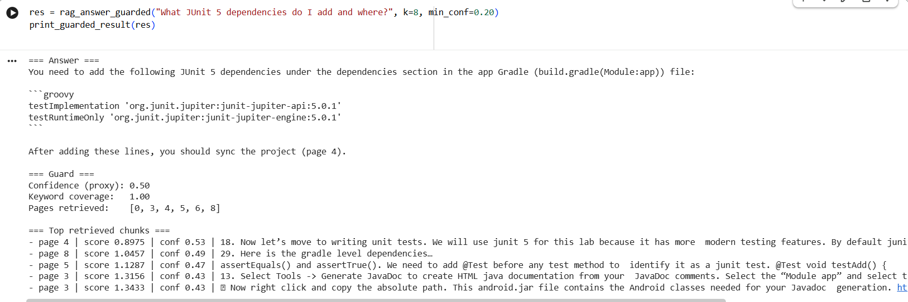
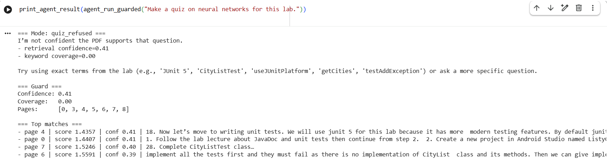
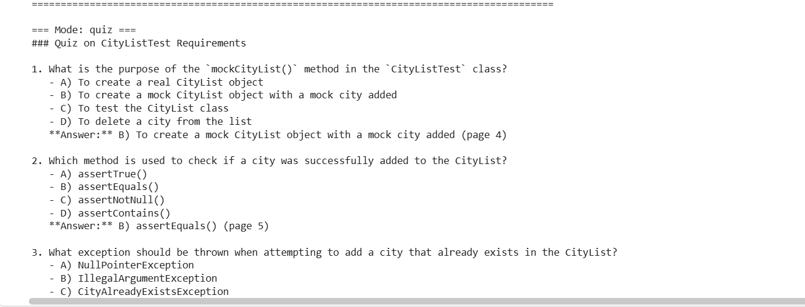

# SmartCampus Agentic RAG
Evidence-grounded PDF Q&A with a hallucination guard (RAG + refusal logic).

## Overview
This project is an agentic Retrieval-Augmented Generation (RAG) assistant that answers questions, produces summaries, and generates quizzes from uploaded PDFs. It is designed to reduce hallucinations by grounding responses in retrieved evidence and refusing unsupported requests.

## Architecture
**User Query**
→ **Vector Retrieval (FAISS)**
→ **Top-k Chunks**
→ **Hallucination Guard**
- Retrieval confidence (distance-based proxy)
- Keyword coverage (query ↔ context overlap)
- Refusal logic (when evidence is weak)
→ **Context-constrained LLM**
→ **QA / Summary / Quiz output (+ citations/pages in outputs)**

## Hallucination Guard
The system refuses generation when:
- retrieval confidence is below a threshold **OR**
- keyword coverage is below a threshold

This prevents “confident-sounding” answers when the PDF does not support the question.

## Demo (Screenshots)

### High-confidence QA

### Refusal case (low coverage / unsupported)

### Quiz generation mode

## Tech Stack
- Python (Google Colab)
- LangChain
- FAISS
- OpenAI embeddings + chat model

## How to Run (Colab)
1. Open the notebook: `SmartCampus_Agentic_RAG.ipynb`
2. Install dependencies
3. Set your `OPENAI_API_KEY` at runtime (key is not stored)
4. Upload a PDF
5. Run queries in QA / summary / quiz modes

## Example Queries
- “What JUnit 5 dependencies do I add and where?”
- “Summarize what Lab 6 requires.”
- “Make a quiz on CityListTest requirements.”
- “What neural network architecture should I use?” → should refuse (unsupported)

## Security
API keys are never committed. The notebook uses runtime key entry (e.g., `getpass()`).

## Author
Priyansha Aggarwal — University of Alberta (CS + Math), graduating April 2026.

